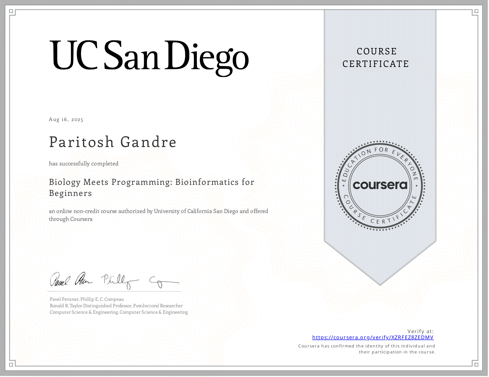

# 🧬 Bioinformatics Meets Programming (UCSD)

This repository contains my completed assignments, notes, and implementations from the **Bioinformatics Meets Programming** course by the University of California, San Diego (UCSD).  

The course blends **biology** and **computer science**, introducing algorithms for DNA analysis, motif finding, and genome assembly.  

I’ve implemented these in **Python** with clean, modular code and comments.

---

## 📑 Table of Contents

- [🚀 Course Overview](#course-overview)  
- [📂 Repository Contents](#repository-contents)  
- [🔑 Main Functions](#main-functions)  
- [📊 Project Highlights](#project-highlights)  
- [🔧 Tech Stack](#tech-stack)  
- [📌 How to Run](#how-to-run)  
- [🤝 Connect](#connect)  

---
## 📃 Certificate

---
<a id="course-overview"></a>
## 🚀 Course Overview
Key questions explored:
1. **Where in the genome does DNA replication begin?**  
   - Finding frequent k-mers and replication origins using **skew diagrams**.  
2. **Which DNA patterns play the role of molecular clocks?**  
   - Motif discovery with **GreedyMotifSearch, RandomizedMotifSearch, GibbsSampler**.  
3. **How do we locate disease-causing mutations?**  
   - Using **entropy, profiles with pseudocounts, and consensus sequences** to detect subtle motifs.  
4. **How do we assemble genomes?**  
   - Constructing **de Bruijn graphs** and solving **Eulerian path/cycle problems** for genome reconstruction.  

---
<a id="repository-contents"></a>
## 📂 Repository Contents
```
bioinfo_programming/
│── ApproximatePatternCount.py
│── ApproximatePatternMatching.py
│── count_motifs.py
│── CountWithPseudocounts.py
│── entropyNFkB.py
│── frequencyWords.py
│── GibssSampler.py
│── GreedyMotifSearch.py
│── GreedyMotifSearchPseudocounts.py
│── HammingDistance.py
│── Probability.py
│── ProfileMostProbableKmer.py
│── ProfilePseudoCount.py
│── random_motif_search.py
│── DosR.txt
│── MTB.py
│── main.py
│── CERTIFICATE.png
```
<a id="main-functions"></a>
## 🔑 Main Functions 
🔹 Pattern Matching & Counting

- ```PatternCount(Text, Pattern)``` – Counts how many times a k-mer appears in a string.

- ```ApproximatePatternMatching(Text, Pattern, d)``` – Finds all positions where a k-mer appears with at most d mismatches.

- ```frequencyWords(Text, k)``` – Identifies the most frequent k-mers in a sequence.

🔹 Motif Finding

- ```GreedyMotifSearch(Dna, k, t)``` – Greedy algorithm to discover motifs in multiple DNA sequences.

- ```GreedyMotifSearchPseudocounts()``` – Improved version using pseudocounts to avoid zero probabilities.

- ```random_motif_search.py``` – Randomized motif search that explores multiple solutions.

- ```GibbsSampler(Dna, k, t, N)``` – Probabilistic motif search using Gibbs sampling.

🔹 Profiles & Probabilities

- ```CountWithPseudocounts(Motifs)``` – Builds a count matrix with Laplace pseudocounts.

- ```ProfileMostProbableKmer(Text, k, Profile)``` – Finds the k-mer in a sequence most likely given a profile.

- ```Probability(Pattern, Profile)``` – Computes probability of a pattern given a profile.

- ```Consensus(Motifs)``` (inside several scripts) – Generates consensus sequence from motif set.

🔹 Distance & Entropy

- ```HammingDistance(Pattern1, Pattern2)``` – Calculates number of mismatches between two strings.

- ```entropyNFkB.py``` – Measures uncertainty/information content in motif logos (example: NF-κB).
<a id="project-highlights"></a>
📊 Project Highlights

- Found frequent k-mers and analyzed bacterial origins of replication.

- Implemented motif discovery algorithms: Greedy, Randomized, Gibbs sampling.

- Computed entropy and information content for motifs like NF-κB.

- Processed DNA datasets (e.g., DosR.txt, MTB.py) for motif analysis.
<a id="tech-stack"></a>
🔧 Tech Stack

- Language: Python 3

- Tools: Jupyter / Python scripts

- Libraries: random, math, collections
<a id="how-to-run"></a>
## 📌 How to Run
Clone the repo and run any script:
```
git clone https://github.com/paritosh100/Bioinformatics-meets-Programming.git
cd bioinfo_programming
python GreedyMotifSearch.py
```
<a id="connect"></a>
## 🤝 Connect
If you’re interested in bioinformatics, computational biology, or data science, feel free to connect:

- 🌐 [LinkedIn](https://linkedin.com/in/paritosh-gandre/)

- 📧 [Email Me](mailto:paritoshkrcg@gmail.com)
           
- 💻 [Portfolio](https://paritosh-gandre.vercel.app)
